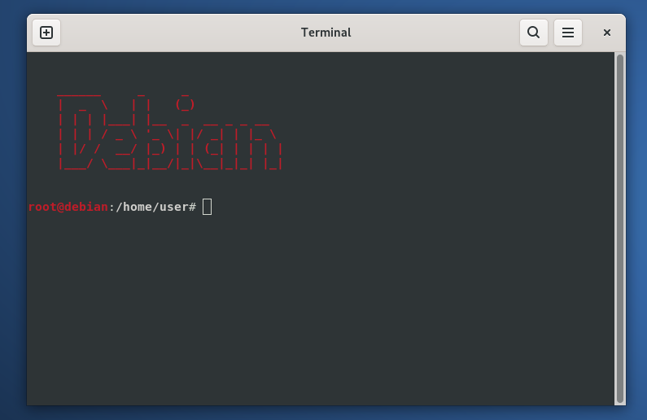

<pre>

<h3>Debian-specific settings</h3>
</pre>

---

### Installation

#### You can add the lines to your /home/username/.bashrc and /root/.bashrc files

<pre>
<b>
# Logo
logo() {
    clear
    echo ""
    echo -e "\e[01;31m"
    echo "    ______     _     _             "
    echo "    |  _  \   | |   (_)            "
    echo "    | | | |___| |__  _  __ _ _ __  "
    echo "    | | | / _ \ '_ \| |/ _| | |_ \ "
    echo "    | |/ /  __/ |_) | | (_| | | | |"
    echo "    |___/ \___|_|__/|_|\__|_|_| |_|"
    echo -e "\e[0m"
    echo ""
}

logo
</b>
</pre>

#### PS1 color

```bash
PS1='${debian_chroot:+($debian_chroot)}\[\033[01;34m\]\u\[\033[01;31m\]@\h\[\033[00m\]:\[\033[01;37m\]\w\[\033[00m\]\$ '
```
#### Root user PS1 color

```bash
PS1='${debian_chroot:+($debian_chroot)}\[\033[01;31m\]\u@\h\[\033[00m\]:\[\033[01;37m\]\w\[\033[00m\]\$ '
```

#### Add the sbin directories to your $PATH if they are not already there
```bash
export PATH="$PATH:/sbin:/usr/sbin"
```

#### Additionally, in the same /home/username/ and /root/ directories, you can copy the .bash_aliases file from the common folder.

```bash
cp -av ../common/.bash_aliases /home/username/
cp -av ../common/.bash_aliases /root/
```
