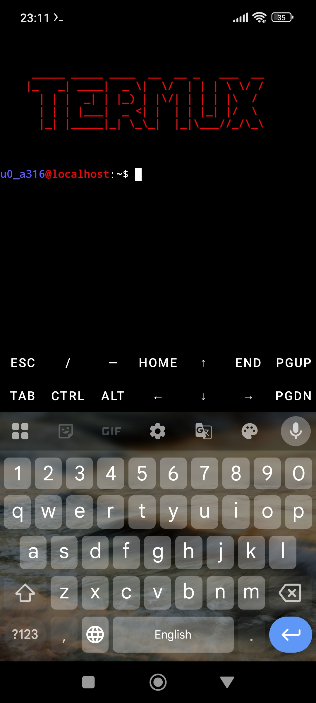

<pre>

<h3>Specific settings for Termux</h3>
</pre>

---

### Installation

#### You can add the .bashrc file to both your home and root directories.

```bash
cp -av .bashrc /data/data/com.termux/files/home
cp -av .bashrc /
```

#### Additionally, in the same home and root directories, you can copy the .bash_aliases file from the common folder.

```bash
cp -av ../common/.bash_aliases /data/data/com.termux/files/home
cp -av ../common/.bash_aliases /
```
