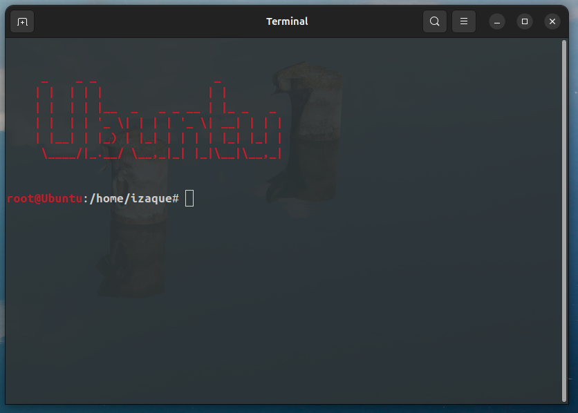

<pre>

<h3>Configurações específicas para Ubuntu</h3>
</pre>

---

### Instalação

```bash
	
	chmod +x install.sh
	
	source install.sh

	./install.sh

```

#### Você pode adicionar a linha aos seus arquivos /home/usuário/.bashrc e /root/.bashrc

```bash
	
	source /etc/ubuntulogo.sh

```

#### Além disso, nos mesmos diretórios /home/usuário/ e /root/, você pode copiar o arquivo .bash_aliases da pasta common

```bash
	
	cp -av ../common/.bash_aliases /home/usuário/
	cp -av ../common/.bash_aliases /root/

```

#### Cor PS1

```bash
	
	PS1='${debian_chroot:+($debian_chroot)}\[\033[01;34m\]\u\[\033[01;31m\]@\h\[\033[00m\]:\[\033[01;37m\]\w\[\033[00m\]\$ '

```
#### Cor do PS1 do usuário Root

```bash

	PS1='${debian_chroot:+($debian_chroot)}\[\033[01;31m\]\u@\h\[\033[00m\]:\[\033[01;37m\]\w\[\033[00m\]\$ '

```

